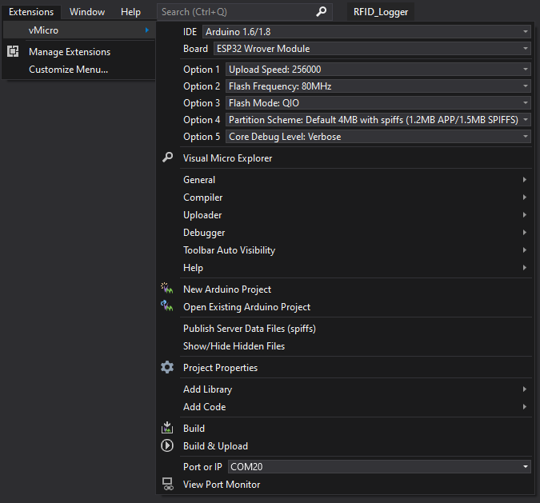
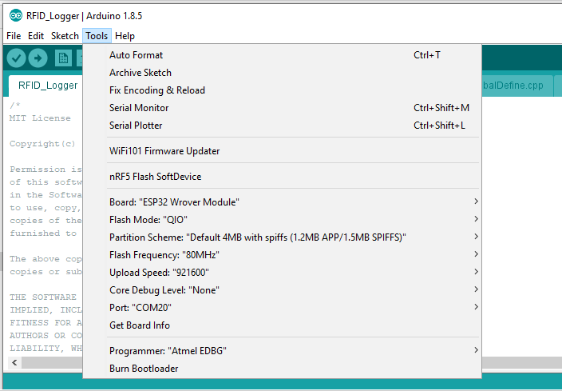

# RFID Logger

This project is in active development. Feedback, ideas, suggestions, and PRs welcome.

## Overview

This RFID Logger project uses the [ThingPulse board](https://thingpulse.com/product/epulse-low-power-esp32-development-board/) 
specifically because of the low-power feature. (likely adaptable to other ESP32 boards, as well) 
along with an RFID reader such as [this Mifare RC522 RFID Reader on Amazon](https://smile.amazon.com/gp/product/B07KGBJ9VG/).
The intention of this project is to keep track of staff movements similar to an IN/OUT attendance board. Clearly much of the reliability
and accuracy is based on the honor system to ensure cards are consistently used. 

## Operation

The ESP32 microcontroller board waits for a card to be detected. Once a card is present, the UID is read and sent to a web server over HTTPS and saves in a SQL table.

In concept, this project could be used to control pretty much anything with the swipe of an RFID card. The receiving code could also be readily modified to save data to other databases, or even a text file.

Although this project focuses on the ESP32, the ESP8266 also works. Both regular and enterprise authentication are also supported.

If you are interested in guest authentication, check out my [desktop dashboard](https://github.com/gojimmypi/DesktopDashboard) that programmatically clicks the "_I accept terms and conditions_" and pressess enter to connect to internet.

## Getting Started

Clone this repo to your local drive (typically in the `c:\workspace` directory for Windows users:
```
c:
mkdir -p c:\workspace
cd workspace
git clone https://github.com/gojimmypi/RFID_Logger.git
```

### Assign your private settings

Edit the `GlobalDefine.h` file, and create/edit your own `myPrivateSettings.h` file:
```
#define USE_myPrivateSettings true

#if USE_myPrivateSettings == true 

#include "/workspace-git/myPrivateSettings.h"

#else

... your settings here for USE_myPrivateSettings == false, or copy example settings to your own myPrivateSettings.h

```
It is _not_ recommended to set `USE_myPrivateSettings == false`, as it is usually best to keep your passwords and private settings someplace that will not be 
inadvertantly saved to GitHub. But yes, you can set this and edit the settings directly in the `GlobalDefine.h` file.

## Build and upload RFID_Logger Code

Check the the ESP32 WROVER is selected, and the appropriate settings for either environment:

### Build with Visual Studio and Visual Micro Arduino IDE Extension.

Install the [Visual Micro IDE Extension](https://marketplace.visualstudio.com/items?itemName=VisualMicro.ArduinoIDEforVisualStudio), if needed.

Open `RFID_Logger.sln` in Visual Studio. 



### Build with Arduino IDE

Open `RFID_Logger.ino` in the Arduino IDE.



## Supported Hardware

Any Arduino-style device with Wi-Fi and SPI capabilities could probably be used;
at this time both the ESP8266 and ESP32 are supported, using either regular or enterprise Wi-Fi, and communicating over SSL. 

The code is Arduino-style C created in Visual Studio using the [Visual Micro Extension](https://www.visualmicro.com/); see also the [Arduino IDE for Visual Studio (Visual Micro) on the marketplace](https://marketplace.visualstudio.com/items?itemName=VisualMicro.ArduinoIDEforVisualStudio). 
It should also work just fine in the Arduino IDE (see the [RFID_Logger.ino](./RFID_Logger.ino) file)

# Design Concepts

The [main app](./RFID_Logger.ino) sits in an infinite loop awaiting a card to be detected. See the [WiFi Helper](./WiFiHelper.cpp)
for connection to WiFi. There's an IIS [Web App](./web/RFID/) for listening for inbound data. Data is saved in a [SQL Table](./SQL/table_RFID_UID_log.sql)
by a [stored procedure](proc_add_RFID_UID_log.sql) called from the [web page](./Web/RFID_aspx_Webform_App/Default.aspx.cs).

With Enterprise Security at the WiFi AP, integrated security could be configured at the web server.

Why not a Raspberry Pi? The only thing we are doing is sending an RFID value to a database. Yes, the implementation would probably be easier on
a Raspberry Pi. But we don't need the complexity and vulerabilities of an entire operating system. An embedded controller is also vastly more
appropriate for low power applications.

This solution should NOT be used for security applications, as noted [here](https://github.com/miguelbalboa/rfid#security) and repeated here:

## Security
-------
* The **UID** of a card **can not be used** as an unique identification for security related projects. Some cards allow the UID to be changed - which means you can easily clone a card. For projects like *access control*, *door opener* or *payment systems* you **must implement** an **additional security mechanism** like a password or normal key.

* This library only supports crypto1-encrypted communication. Crypto1 has been known as _broken_ for a few years, so it does NOT offer ANY security, it is virtually unencrypted communication. **Do not use it for any security related applications!**

* This library does not offer 3DES or AES authentication used by cards like the Mifare DESFire, it may be possible to be implemented because the datasheet says there is support. We hope for pull requests :).

# Libraries needed:

In the Arduino IDE, under `File` - `Prewferences`, enter a comma-delimited `Additional Boards Manager URL` such as these two for the ESP8266 and ESP32:

```
https://arduino.esp8266.com/stable/package_esp8266com_index.json,https://dl.espressif.com/dl/package_esp32_index.json
```

# Low Power Mode

Unfortunately, the D1 LED on the blue version of the board is a straight 1K power to ground as shown on the [schematic](./doc/RFID_Schematic.png). 
This LED drops about 1.8v so we have (3.3 - 1.8) / 1000 = 1.5mA wasted on a power indicator we can't even control. 
The entire RFID board consumes just under 10mA during normal operation (9.67mA measured).

See section `8.6 Power reduction modes` (page 33) of the [MFRC522 data sheet](./docs/MFRC522.pdf) and 


There's a [SunFounder Mifare RC522 Card Reader](https://www.amazon.com/dp/B00E0ODLWQ/) that is more expensive, but appears to
not have the LED. The [wiki](http://wiki.sunfounder.cc/index.php?title=Mifare_RC522_Module_RFID_Reader#Electrical_Parameters) claims the idle current is still 10-13mA.

# Parts

* [ePulse – Low Power ESP32 development board](https://thingpulse.com/product/epulse-low-power-esp32-development-board/)
* [Mifare RC522 RF IC Card Sensor Module](https://www.amazon.com/dp/B01CSTW0IA/)
* [Project Enclosure](https://www.amazon.com/dp/B07TYNYW1S/) (consider getting something with mounting ears if needed, and if you need room for a battery)
* 13.56MHz RFID Access Control such as these [read-only Keyfobs](https://www.amazon.com/dp/B07DYMH7DQ/), or these [Rewritable ones](https://www.amazon.com/dp/B07DWTX88W) ones, smart cards such as [these](https://www.amazon.com/dp/B07S63VTP6/).
* internal mounting hardware: platic screws, ziptie, foam to insulate boards to avoid touching each other.

# Not PN532 NFC/RFID

This code is not compatible with the PN532 NFC/RFID technology, such as the [Adafruit PN532 ](https://www.adafruit.com/products/364)

# Not 125kHz RFID Key Fob

Although they may look similar, this solution does not work with 125kHz RFID Key Fobs. 

# Troubleshooting

* Make sure firewall port 443 is open on target system for the Wi-Fi IP address of your device. (beware DHCP addresses can _change_ over time)
* Check to see if any other program is using the COM port (Other instances of Visual Studio, Arduino IDE Serial Monitor, putty sessions, VM connections, etc.)
* See [miguelbalboa/rfid](https://github.com/miguelbalboa/rfid#troubleshooting)

# Links to this project:

* [Hackaday](https://hackaday.io/project/172244-rfid-badge-logger-check-in-and-check-out)
* [hackster.io ](https://www.hackster.io/gojimmypi/rfid-badge-logger-check-in-and-check-out-1137d8)

# Resources, Inspiration, Credits, and Other Links:  

I'd like to thank:
* [Dani](https://twitter.com/squix78?lang=en) for all the creative ideas exchanged via DM
* [Martin](https://github.com/martinius96) for all the great RFID code examples
* [Espressif](https://www.espressif.com/) for a simply amazing, low cost embedded controller: the ESP32

Essentials:
* [ePulse – Low Power ESP32 development board](https://thingpulse.com/product/epulse-low-power-esp32-development-board/)
* [Easy EDA RFID MFRC522](https://easyeda.com/gerrychen/RFID_MFRC522-lHBSasmEW)
* [Visual Micro Arduino IDE](https://www.visualmicro.com/) for [Visual Studio](https://visualstudio.microsoft.com/)
* [ESP8266 Install / Boards Manager](https://arduino-esp8266.readthedocs.io/en/latest/installing.html#using-git-version)

Code samples:
* [espressif/arduino-esp32 WiFiClientSecureEnterprise.ino example](https://github.com/espressif/arduino-esp32/blob/master/libraries/WiFiClientSecure/examples/WiFiClientSecureEnterprise/WiFiClientSecureEnterprise.ino)
* [martinius96/ESP32-eduroam](https://github.com/martinius96/ESP32-eduroam) (excellent place to get started; many examples)
* [Using a MFRC522 reader to read and write MIFARE RFID cards on ARDUINO through the MFRC522 library BY COOQROBOT](https://github.com/miguelbalboa/rfid/blob/master/doc/rfidmifare.pdf)
* [JeroenBeemster ESP32 WPA2 Enterprise example simplified for Arduino](https://github.com/JeroenBeemster/ESP32-WPA2-enterprise)
* [esp8266wifi client secure examples](https://arduino-esp8266.readthedocs.io/en/latest/esp8266wifi/client-secure-examples.html)
* [espressif/arduino-esp32: Is it possible to connect to WPA2 Enterprise with Arduino IDE #160](https://github.com/espressif/arduino-esp32/issues/160)
* [esp8266/Arduino/libraries/ESP8266WiFi/src/](https://github.com/esp8266/Arduino/tree/master/libraries/ESP8266WiFi/src)
* [esp8266/Arduino/tools/sdk/include/wpa2_enterprise.h](https://github.com/esp8266/Arduino/blob/master/tools/sdk/include/wpa2_enterprise.h)

WiFi:
* [arduino-esp8266.readthedocs BearSSL WiFi Classes](https://arduino-esp8266.readthedocs.io/en/latest/esp8266wifi/bearssl-client-secure-class.html)
* [esp8266.com WPA2 Enteprise Authentication](https://www.esp8266.com/viewtopic.php?p=79527#)

HTTP:
* [stackoverflow Format of an HTTP get request](https://stackoverflow.com/questions/21195956/format-of-an-http-get-request)
* [techtutorialsx ESP32: HTTP POST Requests](https://techtutorialsx.com/2017/05/20/esp32-http-post-requests/)

RFID:
* [smartcardfocus.com - How to read a MiFare card using PC/SC](https://buzz.smartcardfocus.com/read-mifare-uid-using-pcsc/)

Power Related:
* [ePulse – Low Power ESP32 development board](https://thingpulse.com/product/epulse-low-power-esp32-development-board/)
* [blog.squix ESP32 Low Power Device Design – Part 1](https://blog.squix.org/2020/04/esp32-door-sensor-part-1.html)
* [Nordic ID: How Different Power Saving Options Affect Your RFID Reader’s Battery Life and Power Consumption](https://www.nordicid.com/resources/expert-article/how-different-power-saving-options-affect-your-rfid-readers-battery-life-and-power-consumption/)
* [Random Nerd Tutorials: ESP32 External Wake Up from Deep Sleep](https://randomnerdtutorials.com/esp32-external-wake-up-deep-sleep/)
* [miguelbalboa/rfid/issues/269 - Power Down Modes](https://github.com/miguelbalboa/rfid/issues/269)

GitHub Issues:
* [esp8266/Arduino WPA2 enterprise with credentials auth ok with radius but still get STATION_WRONG_PASSWORD after 30s #6803](https://github.com/esp8266/Arduino/issues/6803)
* [espressif/arduino-esp32 WifiClientSecure connect(IPAddress ip, hostport) not working #1487](https://github.com/espressif/arduino-esp32/issues/1487)
* [espressif/arduino-esp32 Cannot enable WPA2 Enterprise using arduino libraries #1744](https://github.com/espressif/arduino-esp32/issues/1744)
* [JeroenBeemster/ESP32-WPA2-enterprise sp_wifi_sta_wpa2_ent_enable() needs a parameters #3](https://github.com/JeroenBeemster/ESP32-WPA2-enterprise/issues/3)

Other stuff:
* [Use an ESP8266 Beacon Spammer to Track Smartphone Users](https://null-byte.wonderhowto.com/how-to/use-esp8266-beacon-spammer-track-smartphone-users-0187599/)
* [Andreas Spiess YouTube: BLE Human Presence Detector using an ESP32 (Tutorial, Arduino IDE)](https://www.youtube.com/watch?v=KNoFdKgvskU)
* [Visual Studio Tips and Traps](https://gojimmypi.blogspot.com/2020/05/visual-studio-fpga-tips-and-traps.html)
